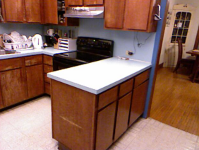
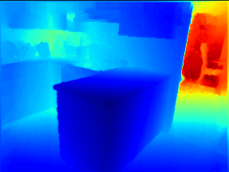
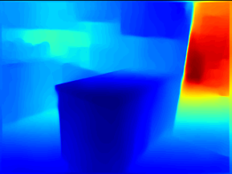
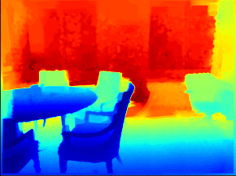
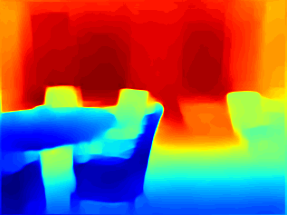

 


# Perceptual Dense Network for High-Quality Monocular Depth Estimation

Here, we propose an approach that integrates learning **low level** and **high level features** to estimate **high-quality depth maps** from **single-view 2-D images**

A deep **fully convolutional architecture** and suitable optimization objectives that minimize **a set of per-pixel loss functions** and **a perceptual loss function**, along with augmentation and training strategies has been employed.

# Results


## Qualitative

| Input RGB Image | Ground truth depth map | Our results|
|:---------------:|:----------------------:|:----------:|
||||
||||

## Quantitative

| |  ||||
| :--------------------------------------------------------------------------------------------------------------: | :----------------------------------------------------------------------------------------------------------------------------: | :--------------------------------------------------------------------------------------------------------------: | :----------------------------------------------------------------------------------------------------------------------------:| :--------------------------------------------------------------------------------------------------------------: | :----------------------------------------------------------------------------------------------------------------------------: 
|0.852 | 0.976 | 0.995 | 0.122 | 0.500 | 0.053
# Instructions
<details>
<summary>
  <b>Installation</b> 
</summary>

To install, execute

```
pip install -r requirements.txt
```
  
</details>
<details>
<summary>
  <b>Data</b>
</summary>
  
[NYU Depth v2 train](https://tinyurl.com/nyu-data-zip)  - (50K images) (4.1 GB)

On extraction, there will be a ```data``` folder.

[NYU Depth v2 test](https://s3-eu-west-1.amazonaws.com/densedepth/nyu_test.zip) - (654 images) (1 GB)
  
On extraction, there will be three ```.npy``` files.

</details>

<details>
<summary>
  <b>Training</b>
</summary>
  
The script ```train.py``` contains the code for training the model. It can be invoked with the following arguments:
  
```
usage: train.py [-h] --train_dir TRAIN_DIR --test_dir TEST_DIR --batch_size
                BATCH_SIZE --checkpoint_dir CHECKPOINT_DIR --epochs EPOCHS
                [--checkpoint CHECKPOINT] [--lr LR]
                [--log_interval LOG_INTERVAL] [--backbone BACKBONE]
                [--test_batch_size TEST_BATCH_SIZE]
                [--perceptual_weight PERCEPTUAL_WEIGHT]

Training of depth estimation model

  -h, --help            show this help message and exit

mandatory arguments:
  --train_dir TRAIN_DIR
                        Train directory path - should contain the 'data'
                        folder
  --test_dir TEST_DIR   Test directory path - should contain 3 files
  --batch_size BATCH_SIZE
                        Batch size to process the train data
  --checkpoint_dir CHECKPOINT_DIR
                        Directory to save checkpoints in
  --epochs EPOCHS       Number of epochs
  
optional arguments:
  --checkpoint CHECKPOINT
                        Model checkpoint path
  --lr LR               Learning rate
  --log_interval LOG_INTERVAL
                        Interval to print the avg. loss and metrics
  --backbone BACKBONE   Model backbone: densenet161 or densenet121
  --test_batch_size TEST_BATCH_SIZE
                        Batch size for frequent testing
  --perceptual_weight PERCEPTUAL_WEIGHT
                        Weight for the perceptual loss

```

</details>

<details>
<summary>
  <b>Evaluation/Inference</b>
</summary>
  
The script ```evaluate.py``` contains the code for evaluating the model/for predicting the depth given an image. It can be invoked with the following arguments:

```

usage: evaluate.py [-h] --model MODEL [--data_dir DATA_DIR] [--img IMG]
                   [--batch_size BATCH_SIZE] [--output_dir OUTPUT_DIR]
                   [--backbone BACKBONE]

Evaluation of depth estimation model on either test data/own images

  -h, --help            show this help message and exit

arguments:
  --model MODEL         Model checkpoint path
  --data_dir DATA_DIR   Test data directory(If evaluation on test data)
  --img IMG             Image path(If evaluation on a single image)
  --batch_size BATCH_SIZE
                        Batch size to process the test data
  --output_dir OUTPUT_DIR
                        Directory to save output depth images
  --backbone BACKBONE   Model backbone - densenet 121 or densenet 161

```

</details>

# Citation

Please cite the following if you find the code useful in your research:

```
@misc{Ashok2020,
  author = {Ashok, Arjun},
  title = {Perceptual Dense Network for High-Quality Monocular Depth Estimation},
  year = {2020},
  publisher = {GitHub},
  journal = {GitHub repository},
  howpublished = {\url{https://github.com/aiarjun/Monocular-Depth-Estimation}},
}
```
